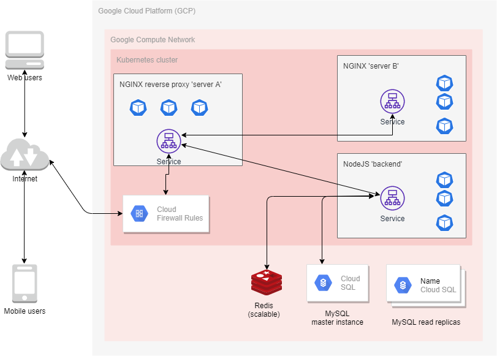

# Cloud SRE Test

## Objective

Migrate the application from on-prem data centre to cloud (GCP)

## Requirements

1. Use Terraform v0.12.x
	- Use remote state
	- Terraform codes should be deployment promotable: Development -> Staging -> Production
	- Teraform codes should be in source control system (Git)

2. Use Google Cloud Platform

3. The service should be
	- highly-available (HA)
	- scalable
	- highly fault-tolerant
	- sending metrics and logs to ELK stack

4. Write scripts and Kubernetes manifests

5. Add security in the deployment pipeline (e.g. SAST, DAST)

6. Make use of ENV variables in 12Factor style

7. Write Dockerfile

8. Write documentation and instructions
	- Present diagram in Draw.io 
	- Present few options on architecture and design 
	- From multiple options, use one in Terraform code 
	- Describe migration plan for huge database which mabe on different engine i.e. MSSQL required to migrate to Cloud SQL 
	- Describe how to make whole project secure including infra, system and application 
	- Infrastructure as Code (Terraform) - use remote state, terraform code should be promotable dev -> staging - > production
	- Put terraform code in Git 

9. Required resources:
	- DNS server with zone for app.com 
	- NGINX 'server A'
			- reverse proxy 
			- URL redirect based on URI 
			- listening on TCP/IP port 80 
			- redirect https://app.com to NGINX 'server B'
			- redirect https://app.com/api/ to NodeJS server 
	- NGINX 'server B' serving static web pages index.html , .css .js 
	- NodeJS server for backend processing 
	- Redis keeps clients connectivity state 
	- MySQL keeps user accounts 

## Solutions

### A few options on the architecture and design

	1. Use kops (kubernetes operations)

kops is a matured set of tools, especially for Amazon Web Services (AWS) platform, for installing, operating and deleting Kubernetes clusters. 

The downside is kops is not versatile for GCP as it is for AWS. For example, kops provide clear documentation to create a Kubernetes cluster in an existing VPC on AWS, but does not for GCP. 

	2. Build infrastructure on GCP using Terraform only

We can build infrastructure on GCP using Terraform only and deploy nodes in the infrastructure.

Kubernetes will be installed to the nodes by using configuration management tools, such as Ansible.

However, this will not provide highly-fault tolerant environment as we will need to manually increase the number of nodes in case the services in the cluster need to scale-up.

	3. Use only Terraform to build the infrastructure on GCP

With Terraform, we can define infrastructure-as-code on GCP and build Kubernetes cluster(s) in it.

With this option, we can have clusters that are:

		1. highly-available (HA)
			- deploy pods into different zone (Multi-AZ)
		2. scalable
			- by creating HorizontalPodAutoscaler object for each service deployment
		3. highly fault-tolerant
			- GCE manages the Kubernetes master control-plane cluster for us for fault-tolerance

### Best-practices

1. . Use blue-green deployment to reduce downtime and risk

We have environments for testing (e.g. development, QA, performance, staging) and two for production (blue and green).

Blue and green are identical production environments where when we can switch to either two by configuring the DNS to point to either one.

2. Install node-exporter (a Prometheus exporter) to send metrics of every Kubernetes nodes/VMs to Prometheus
	- Deploy node-exporter as DaemonSet
	- node-exporter will send metrics of the nodes, such as CPU, memory and disk usage to Prometheus and Grafana will be used for visualization and alerting

3. Install fluentd (part of ELK/Elastic stack) to send application logs to Kibana for visualization and alerting
	- Deploy fluentd as DaemonSet 
	- fluentd will read logs of every container in every Kubernetes nodes
	- Logs will be forwarded to Elasticsearch for digestion
	- Kibana will be used as visualization and alerting

4. Migration plan for huge database on different engine (e.g. MSSQL) to GCP Cloud SQL (MySQL)
	- MySQL Workbench
		- This tool is able to perform the migration from MSSQL to MySQL
	- Writing script to perform the copy and paste
		- Python is a good programming language for data processing
		- A script can be written to describe every MSSQL tables and create similar ones for MySQL, and extract the data from source table to destionation table

5. Securing the infrastructure, application deployment and system
	- Vault:
		- All credentials such as tokens, passwords, API keys must be stored in a highly-secured environment. HashiCorp Vault is a tool that provides this solution
		- It provides Vault secret for every request to credentials, and the secrets have expiry time. 
	- Credentials should not be kept by engineers, but rather stored on Jenkins (for example) by administrators. For every deployment, build and release pipelines will read credentials from the platform (such as Jenkins) whenever required
	- Use DevOps tools in the build and release pipelines:
		1. SonarQube
			- It supports most of programming languages such as Java, C#, C, C++, JavaScript, Python, Go, PHP and Swift
			- It detects code issues
		2. Synopsys Detect
			- Once integrated in the pipeline, the tool will identify open source risk from the source codes such as license risk, known vulnerabilities and reported threats
		3. Veracode
			- Developers can integrate Veracode into their IDEs for static analysis
			- Integrate Veracode into build pipeline for static analysis before deployment

### Steps

1. Install terraform 0.12.x 

2. Create GCP account 
	- GCP account created
	- Project created: https://console.cloud.google.com/billing/0162E4-714053-16D7FE?project=named-container-280813

3. Create Terraform files
	- 3 Environments (Terraform workspaces):
		1. development
		2. staging
		3. production
	- List Terraform workspaces:
		- terraform workspace list
	- Create a Terraform workspace:
		- terraform workspace new [environment name]
	- Select a Terraform workspace:
		- terraform workspace select [environment name]

4. Build the infrastructure defined in the Terraform files
	- Download GCP credentials .json from https://console.cloud.google.com

	- Read the README.md in the 'infrastructure-as-code' folder

	- Build the infrastructure

	- These objects should be running:
		- Private VPC network
		- Firewall
		- Kubernetes cluster
		- MySQL database instance (master + replicas)
		- Redis instance

6. Download kubeconfig from 'gcloud container'
	- List clusters
		- gcloud container clusters list

	- Download kubecfg
		- gcloud container clusters get-credentials [cluster-name] --region us-central1
		- e.g. : gcloud container clusters get-credentials k8s-airasia-dev --region us-central1

	- The kubeconfig is ~/.kube/config

7. Test 'kubectl' command
	- Execute:
		- kubectl get all --all-namespaces

8. Deploy NGINX server B
	- It listens on port 80
	- From NGINX reverse proxy server A, it receives forwarded requests from URI https://app.com/
	- Read the README.md

9. Deploy NodeJS service for backend processing
	- It listens on port 80
	- From NGINX reverse proxy server A, it receives forwarded requests from URI https://app.com/api
	- Read the README.md

10. Deploy NGINX server A
	- It listens on port 80
	- It acts as a 'reverse proxy' server
	- It does 'URL rewrite'
		- Redirect https://app.com/ to NGINX Server B
		- Redirect https://app.com/api/ to NodeJS server
	- Read the README.md

